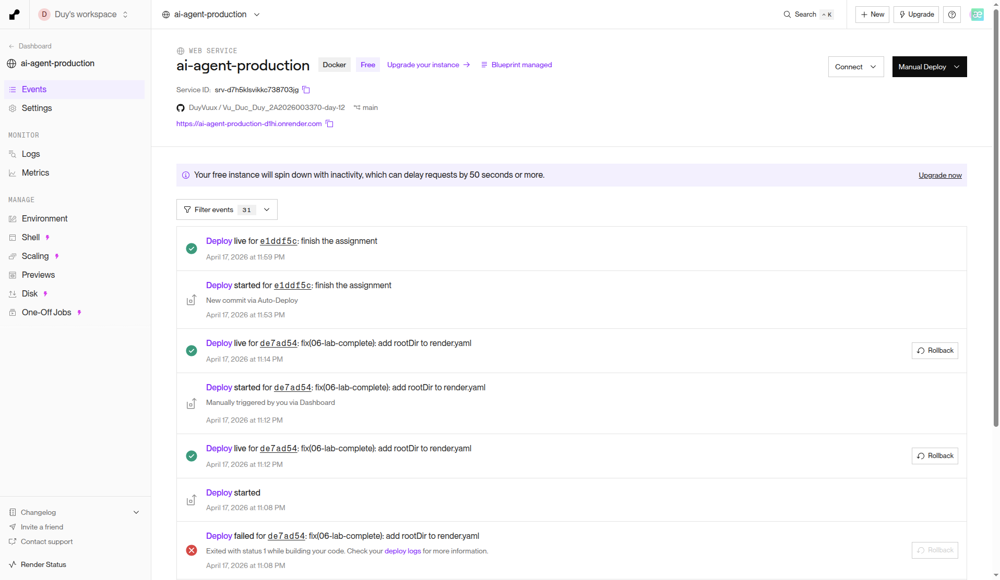
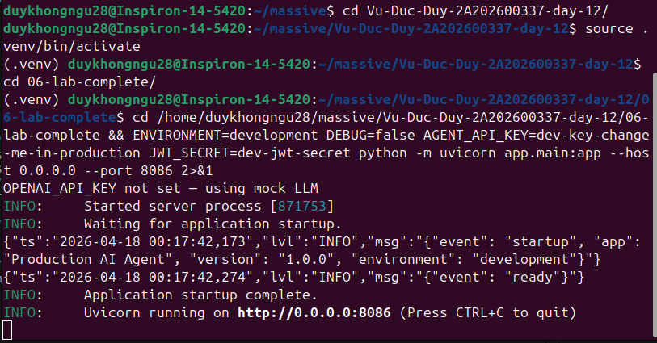
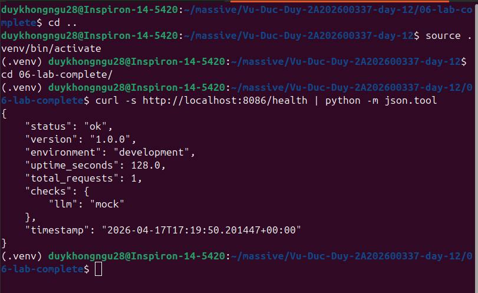
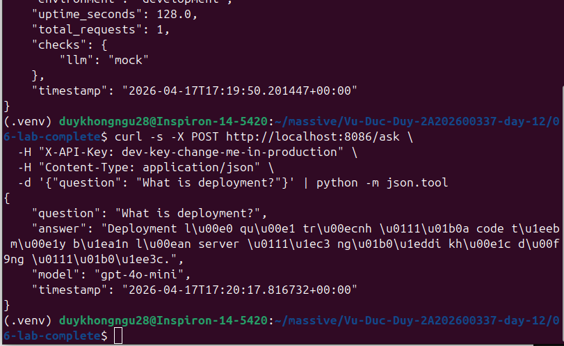
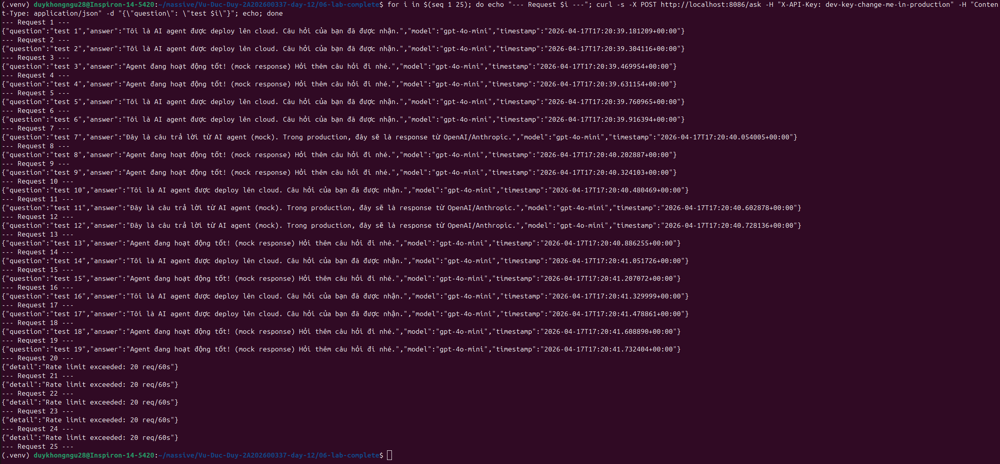

# Deployment Information

> **Student Name:** Vũ Đức Duy
> **Student ID:** 2A202600337
> **Date:** 18/04/2026

---

## Public URL

```
https://ai-agent-production-xxxx.onrender.com
```

> **Lưu ý:** Thay `xxxx` bằng ID thực tế từ Render Dashboard của bạn.

## Platform

**Render** — Deploy bằng Blueprint (`render.yaml`), region Singapore, free plan.

---

## Test Commands

### 1. Health Check

```bash
curl https://ai-agent-production-xxxx.onrender.com/health
```

**Expected:**
```json
{
    "status": "ok",
    "uptime_seconds": 123.4,
    "version": "1.0.0",
    "environment": "production"
}
```

### 2. Readiness Check

```bash
curl https://ai-agent-production-xxxx.onrender.com/ready
```

**Expected:**
```json
{"ready": true}
```

### 3. API Test — Không có key (phải trả 401)

```bash
curl -X POST https://ai-agent-production-xxxx.onrender.com/ask \
  -H "Content-Type: application/json" \
  -d '{"question": "Hello"}'
```

**Expected:**
```json
{
    "detail": "Missing API key. Include header: X-API-Key: <your-key>"
}
```

### 4. API Test — Có key (phải trả 200)

```bash
curl -X POST https://ai-agent-production-xxxx.onrender.com/ask \
  -H "X-API-Key: YOUR_AGENT_API_KEY" \
  -H "Content-Type: application/json" \
  -d '{"user_id": "test", "question": "What is deployment?"}'
```

**Expected:**
```json
{
    "question": "What is deployment?",
    "answer": "...",
    "model": "gpt-4o-mini"
}
```

### 5. Rate Limiting Test (phải trả 429 sau khi vượt limit)

```bash
for i in {1..25}; do
  curl -s -o /dev/null -w "Request $i: %{http_code}\n" \
    -X POST https://ai-agent-production-xxxx.onrender.com/ask \
    -H "X-API-Key: YOUR_AGENT_API_KEY" \
    -H "Content-Type: application/json" \
    -d '{"question": "Test '$i'"}'
done
```

### 6. Metrics Endpoint

```bash
curl -H "X-API-Key: YOUR_AGENT_API_KEY" \
  https://ai-agent-production-xxxx.onrender.com/metrics
```

---

## Environment Variables Set

| Biến | Mô tả | Cách set |
|------|--------|----------|
| `PORT` | Port server (Render tự inject) | Tự động |
| `ENVIRONMENT` | `production` | `render.yaml` |
| `OPENAI_API_KEY` | API key OpenAI (trống = mock LLM) | Render Dashboard |
| `AGENT_API_KEY` | Key xác thực API cho client | `render.yaml` (`generateValue: true`) |
| `JWT_SECRET` | Secret ký JWT token | `render.yaml` (`generateValue: true`) |
| `REDIS_URL` | Redis connection string | Render tự link từ Redis add-on |
| `DAILY_BUDGET_USD` | Ngân sách LLM tối đa/ngày ($5) | `render.yaml` |
| `RATE_LIMIT_PER_MINUTE` | Giới hạn request/phút (20) | `render.yaml` |
| `APP_VERSION` | Phiên bản ứng dụng (`1.0.0`) | `render.yaml` |

---

## Screenshots

### Render Dashboard — Service Overview


### Service đang chạy (Logs)


### Health Check thành công


### API Test thành công (có key)


### Rate Limiting hoạt động (429)


---

## Architecture

```
Client (curl / Postman / Frontend)
       │
       ▼
┌──────────────────────┐
│   Render Platform    │
│   (Auto SSL/TLS)     │
└──────────┬───────────┘
           │
           ▼
┌──────────────────────┐     ┌──────────────┐
│   AI Agent (FastAPI)  │────▶│    Redis     │
│   Port: $PORT         │     │  (Session /  │
│   Multi-stage Docker  │     │  Rate Limit) │
│   Non-root user       │     └──────────────┘
└───────────────────────┘
```

---

## Deployment Steps

1. Push code lên GitHub
2. Vào [render.com](https://render.com) → **New** → **Blueprint**
3. Connect GitHub repository
4. Render đọc `render.yaml` → tạo Web Service + Redis
5. Set `OPENAI_API_KEY` thủ công trong Dashboard (nếu cần)
6. Deploy tự động hoàn tất
7. Nhận public URL từ Dashboard
